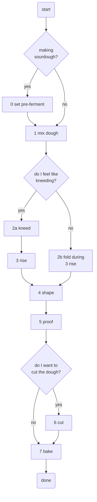

# Bread - about making bread

Bread, a delicious hijacking of the biochemical machinery of grains.

## Making bread

You can make bread in a lot of different ways and there are drawbacks and benefits with each.
Usually, I try to maximize the quality of bread based on effort.

That said, here is a flow diagram showing the process:

Now, to the individual steps.

### 0. Pre-ferment
For sourdough bread I recommend setting a pre-ferment, that is, mixing a bit of the recipes' flour and water (equal mass), with a bit of sourdough base. This is because sourdough rises
quite a bit slower than store bought yeast and setting the pre-ferment lets the rising begin before the bread dough is mixed.

This can also be done with yeast but then it is more to increase the fermenation flavor while also reducing the flavor of yeat (allowing you to use less yeast).

The pre-ferment usually needs to sit at room temperature for about 8 hours or so, making it suitable for setting the night before you plan to bake.

### 1. Mix the dough
Add the dry ingredients (and the pre-ferment) to a bowl and then add the water. Mixing in this order seems to reduce the amount of lumps in the dough, and a dough without lumps is the sort of the point.

If you're using dry-yeast (without pre-ferment) you should mix it with the flour and let sit for 10 minutes before adding water to give the yeast a gentle awakening.

To mix the dough properly I usually submerge one of my hands completely in the ingredients and grab at the dough. This is a pretty efficient way of mixing because you can feel if there are lumps and also makes sure you mix _all_ the flour quite easily. But, you do get very sticky with glops of dough hanging from your hand - scrape off the worst with a spoon (or something else with a soft edge) and then clean it with water. It's just dough, it will come off eventually.

After the dough has been mixed let it rest 30 minutes and then you have to make a decision - kneed or fold?
Both of these methods are used create structure in the gluten which allows the bread to become
higher during baking.

### 2a. Kneed
When you kneed you try to elongate the gluten strings and your goal is to create a dough that has a homogenous look - flat surface and lean texture. You can do the "window test" to examine the gluten structure. The window test is done by stretching a piece of dough, thinly, so you can see a light source through it. The optimal "window" would have a surface above 5 by 5 cm wit a lean internal structure. However, this is pretty hard to achieve and only necessary for specific breads like croissants. But if you have some extra time (and patience), go for it! It can take about 15 minutes of significant effort.

### 2b. Fold
Fold is a time efficient method of creating an acceptable gluten structure. It is done by folding the dough multiple times during rising, about 3 times is good.

To fold the dough grab an edge by scooping your hand under it from a side. When you have a grip, stretch the dough by pulling it upward and then fold it towards the opposite side of the bowl. Follow the side of the bowl until you've completed a circle.

Usually, to keep the dough from sticking to my hands a first coat them in water and try work as fast as possible. With rapid movements you can avoid much of the stickiness.

### 3. Rise

Let the dough sit in its bowl, somewhat air tight (I use a plate as cover). It should rise significantly, about double in volume, although this may be hard to tell. In essence, what you want is to let it become as big as possible without collapsing. You should be able to tell that it is full of gas, you may poke it.

Initially, if you want to check if any rising is happening, you may scrape at the bottom edge of the bowl with your hand and see if there is a structure with a bunch a tiny holes - the gas pockets beginning to form from the rising agent's activity.

Regarding the air tight-ish lid, it accomplishes two things:
1. Persevers the doughs moisture.
2. Creates anaerobic conditions for the microbial culture doing the rising, i.e. the metabolizing of starch and sugars into alcohols, lactic acid, and carbon dioxide. The biproducts from the metabolism give the flavor and the gas is what does the actual rising.

The rising time is affected by the rising agent (yeast or sourdough) and the ambient temperature. So, you can slow down the process by setting the dough somewhere cold (fridge,
or balcony), or speed it up setting it somewhere warm. Note that this means that seasons may affect baking times, for example I usually find that summer baking goes surprisingly fast.

### 4. Shape

When the dough has risen it is time to shape it into loafs or buns.
Now, before you scrape the dough out of the bowl onto a suitable surface: either sprinkle flour, coat with _water_ or a bit of _oil_. 

- Flour is the traditional anti-stick method, but
it has the drawback of drying out the bread if used in large amounts and may even create new lumps in the bread, so - use a sparse amount. Also, flour on the finished bread is just not as nice to eat, you get flour in your mouth and everywhere else.
- Water is based on a misunderstanding of mine along with a way of anti-stick when shaping sushi. Basically, you coat the working surface with a thin layer of water. Do the same with your hands and the scraper. The positives with this approach is that you can get a bread which has no flour on it! But, you need to work quickly so the dough doesn't get diluted too much. You can also clean the working surface quite easily afterwards. Last thing, you cannot place a towel directly onto wet dough, nor anything else really, so you cannot cover it easily during proofing.
- Oil is used in some recipes and works similar to water with the edge that it doesn't require the same amount so the risk of dilution is decreased. It also doesn't mix as easily with the bread as water does. But, the crust can get a slightly different flavor from the oil, which may be unwanted.

For beginners and alos for more advanced bread shapes I recommend adequate amounts of flour.

Now, to the actual shaping. Scrape the dough out of its bowl onto the working surface. Depending on what type of bread you're doing you might divide it into smaller pieces or make one big loaf. Regardless of the method, the aim of the shaping is to provide some tension in the gluten structure the works to produce a high bun or loaf with certain aesthetic proportions. To do this you usually want to stretch the bread by pushing it against the working surface (which should stick a little, you want _some_ friction) or folding the bread.

When you've achieved the desired shape, or realized there is nothing more to be done for the poor lump of dough, move it to a surface lined with parchment paper, preferably a baking tray.

Oh, and one more thing, some people like big bubbles in their bread and some people don't. I think it depends on what you want to do with the bread, or rather - what the cross-section will be. Bread slices with big holes for example will (obviously) seive liquid toppings for you. Slice it lenghtwise and its not a problem, but maybe you're not hungry enough to eat an entire loaf of bread. So, to reduce big bubbles during shaping, press the dough down and squish the bubbles. If you want them there, let them be.

### 5. Proof

Proofing is when the dough rests in its final shape before being baked in the oven. As a rule of thumb, you should always let the dough proof for about an hour. Here, as with rising, the goal is to let the dough expand as much as possible without collapsing. If you skip proofing, or underproof, you will usually end up with a section of the bread that has almost no bubbles in it - making it quite dense and sometimes even doughy. Not a catastrophe but not ideal either.

### 6. Cut

For optimizing aesthetics and loaf/bun height you will want to cut the dough **just before it goes into the oven**. You do this to control where your loaf or bun opens up from the force of expanding gas applied during baking. In essence, you make a somewhat deep cut, generally **orthogonally against the added tension during shaping**, which is what you want to weaken with the cut. A cut completely parallel to the loaf/bun's tension will accomplish no magnificent "lip".
You can also make cuts where the pattern is the only point of course.

This step may also be omitted entirely, but then the bread may rupture anywhere, usually along the edge of contact between dough and surface.

### 7. Bake

You should heat your oven well in advance so it is nice and hot for your bread-to-be. You can then add water to the oven to increase the heat conductivity or, use things like a pizza stone, or anything massive and oven-proof, to give the oven more consistent temperature.

During the initial time in the oven, you have a to competing processes racing against each other. One is the expansion of the trapped gas inside the bread (with some vaporization too, I say some because the inside of the bread doesn't reach temperatures of more than 60-70 degrees Celsius) which is what makes the bread even bigger. The other process is the hardening of the crust which will ultimately prohibit further rise. This happens around the 10 first minutes of baking.

I usually aim for a nice golden or dark brown crust, because who doesn't like a nice Maillard reaction?

## Recipes

The key to any bread recipe is the ratio between `flour mass/water mass`, known as "hydration" (bagarmått, "baker's measure", in Swedish). The reason hydration is so important is that it controls a lot of different aspects of the dough and the resulting bread.

A drier dough is easier to work with in the sense that it doesn't stick to everything but it usually means that it becomes denser, gets smaller bubbles and - that the bread is drier. It also bakes faster if it has less water, probably because it needs less energy to reach key temperatures.

A wetter dough is harder to work with, in fact - it may not even be possible to kneed it by hand. It may very well stick to absolutely everything, making shaping especially hard.
But, since it is less dense - more flexible, it rises more quickly, gets bigger bubbles and the bread becomes more moist.

Neither extreme might be desirable and if you're making your own recipe or working without one completely, you should think about what properties you want your bread to have and chose appropriate hydration.

For example, I usually make a "levain" loaf which has a hydration of 72%. This is pretty wet, and would be pretty hard to shape into nice baguettes or similar. Sometimes, the proofed dough looks like a wobbly, thick pancake only to blossom into a nice loaf in the oven.

### Levain - our loaf staple

Based on the recipe of "Stockholms Levain" from _Bröd, bröd, bröd_ by Martin Johansson:

| weight (g) | ingredient | notes |
|--------|------------|-------|
| 900 | wheat flour | 10% protein - "normal flour"
| 650 | water | ~72% hydration, cold water
| 18  | salt | 2% of the flour mass
| 20  | kruskakli | wheat husks, adds some fiber
| - | sourdough base | a tablespoon or two, exact proportions don't matter much

This is a _big_ loaf, you can easily adapt the recipe to make a smaller one, just keep an eye on the bake time.

1. Take 150 grams of flour and water (from the total) and mix it with the starter to make the pre-ferment. Let sit for 6-10 hours (over night).
2. Mix the other ingredients.
3. Rise for about four hours with intermittent folds - fold three times in the beginning with about half an hour in between.
4. Shape the dough into a long loaf. Stretch and fold it from the long side towards the middle, once per side, and the fold it in the middle once more. Let it proof seem down.
5. Proof for an hour. Set oven to 250 degrees while heating.
6. Lower the oven temperature to 230 just before baking, let bake for 40-45 minutes.

## Sourdough base

To keep a sourdough base alive, keep it in a refrigerator and refresh it once a week by discarding about half of it and then about a tablespoon of wheat flour and some water and mixing. Even if you get mold inside of the container you can migrate a small amount of it and adding water and flour again. When you're "reviving it" you can keep it at room temperature, the fridge is just used to slow its metabolism.

You can use the discarded sourdough base for baking when you refresh it, although it is preferable to bake with recently fed one.

### From scratch

To start a new sourdough base you need to find impure wheat flour. You just mix water and flour and let it sit at room temperature to see if anything happens. If nothing happens try again, perhaps with a different flour. You can also try starting with a rye flour and then migrate it to wheat after you've gotten some microbial action.